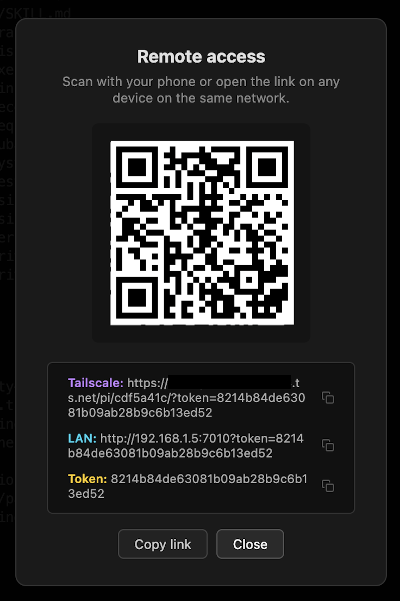
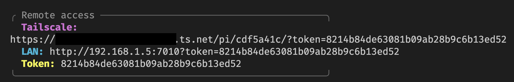

# pi-mono-extensions

Monorepo for pi extensions. Fork of [@q.roy/pi-remote](https://github.com/ruanqisevik/pi-mono-extensions) with Tailscale integration.

## Packages

| Package | Description |
|---------|-------------|
| [remote](packages/remote) | Remote terminal access for pi via WebSocket and browser, with automatic Tailscale HTTPS serving |

## Screenshots

### Browser — Remote access modal

### TUI — Widget with Tailscale, LAN, and Token

